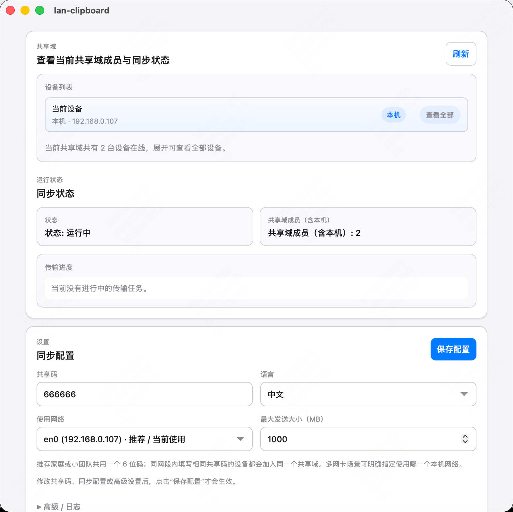

  

<h1 align="center">lan-clipboard</h1>

  <b>同一局域网内的 macOS / Windows 共享剪贴板。</b> 
  Tauri UI · Rust Core · 共享域自动发现

  
  
  
  

  <a href="./docs/README.zh-CN.md">📖 文档</a> ·
  <a href="./docs/dev.md">🧰 开发/联调</a> ·
  <a href="https://github.com/sqmw/lan-clipboard/issues">🐛 反馈</a> ·
  <a href="https://github.com/sqmw/lan-clipboard">⭐ Star</a>

  <b>🇨🇳 中文</b> | <a href="README.en.md"><b>🇬🇧 English</b></a>

---

## 🖼️ 界面截图

  

<i>围绕共享域、传输状态与必要配置展开，尽量减少多余操作和视觉噪声。</i>

## 🎯 设计原则

- **简洁优先**：界面只保留共享域、网络选择、大小限制、传输进度这些真正影响使用的核心信息
- **高效优先**：默认围绕“打开即用、同码入域、复制即同步”设计，而不是让用户理解复杂连接流程
- **可调试但不打扰**：运行日志、进度、成员状态都能看，但默认收纳到合适位置，避免主界面噪声

## ✨ 特性

- **共享域模型**：同一局域网内填写相同 26 位高熵配对密钥的设备自动加入同一共享域
- **共享域防抖**：同一内容在共享域内只允许一次有效发送；发送中的重复复制直接丢弃，发送成功后的连续重复复制也会被发送前拦截
- **自动发现**：`mDNS + UDP 心跳` 只维护有界候选缓存；TCP 固定长度握手完成后才信任连接
- **事件驱动同步**：剪贴板变化入队后以 TCP 二进制帧推送到共享域成员
- **常用类型**：文本 / 图片(PNG) / 文件与目录 / 基础富文本(HTML/RTF)
- **认证加密**：每条连接使用独立会话密钥，控制帧与文件流强制加密，不能降级为明文
- **多网卡支持**：可选择本机使用网络，避免虚拟网卡影响发现
- **调试友好**：发送/接收进度、类型与预览展示；日志入口收纳在“高级/日志”

## 🚀 快速开始（Win + macOS）

1. 两台设备连接同一局域网并启动应用。
2. 从一台设备复制应用生成的 26 位配对密钥，在另一台设备填入并点击“保存配置”。
3. 如遇多网卡/虚拟网卡，先在“使用网络”选择实际局域网 IP，再保存。
4. 点击“刷新”确认成员列表出现对端设备。
5. 在任意一端复制文本/图片/文件(目录)或富文本，对端可直接粘贴。

补充说明：
同一个文件或同一份剪贴板内容如果连续复制多次，应用只保证第一次有效同步平稳到达；后续重复复制会被视为共享域内的重复内容并直接丢弃，用来减少回环风险和带宽浪费。

从 `1.x / v3` 升级到 `2.0.0 / v4` 时，所有设备必须一起升级并重新配对。旧 6 位共享码配置会先备份再迁移；新旧协议不互通，也不会回退到明文。

## 📚 文档入口

- `docs/README.zh-CN.md`：文档总入口
- `docs/status.md`：当前支持、边界、关键参数（含吞吐说明）
- `docs/dev.md`：开发 / 联调 / 排障
- `docs/todo.md`：里程碑与待办

## ⚠️ 当前边界

- “任何类型”不等于“任意私有剪贴板格式完全等价”；以跨平台支持的格式集合为边界（见 `docs/protocol.md`）
- 当前版本仍未把局域网传输速度稳定优化到“吃满带宽”；对大文件/大图片高吞吐场景仍需继续优化（见 `docs/status.md` 的“吞吐说明”）
- 当前认证单位是“持有同一配对密钥的共享域”，不是逐设备证书；密钥只应复制给可信设备（见 `docs/security.md`）
